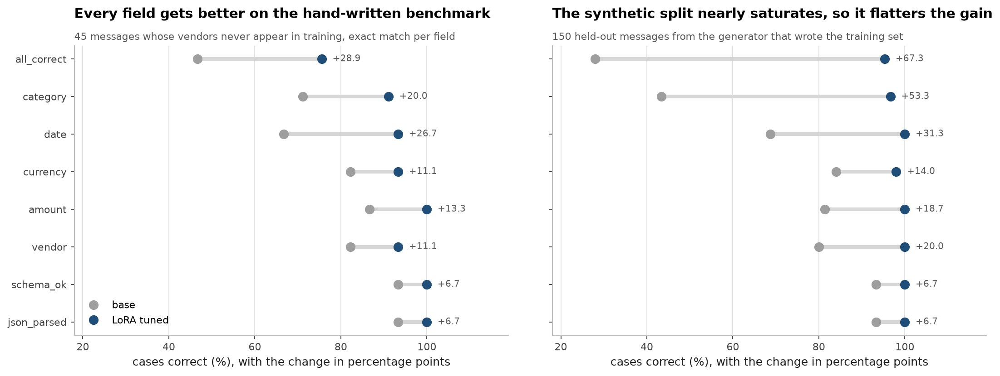
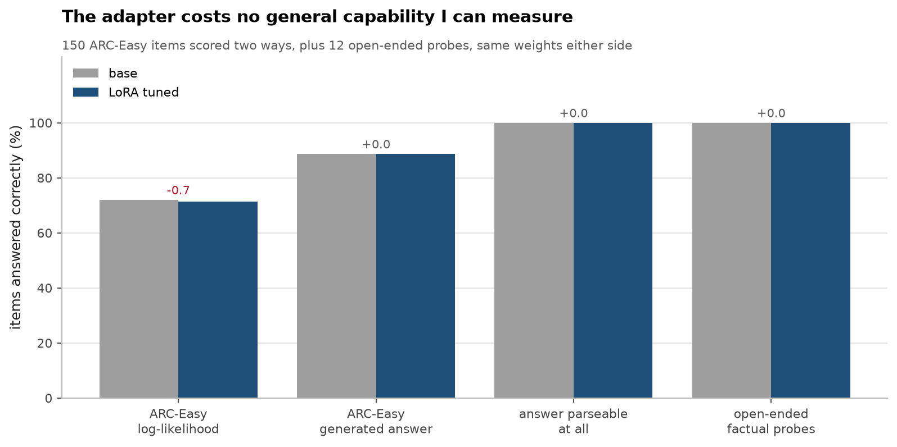
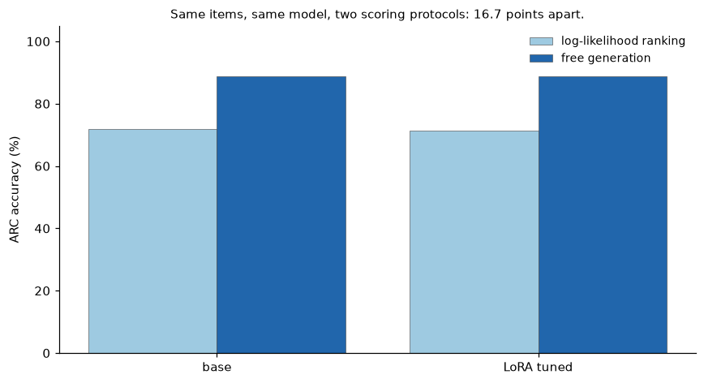
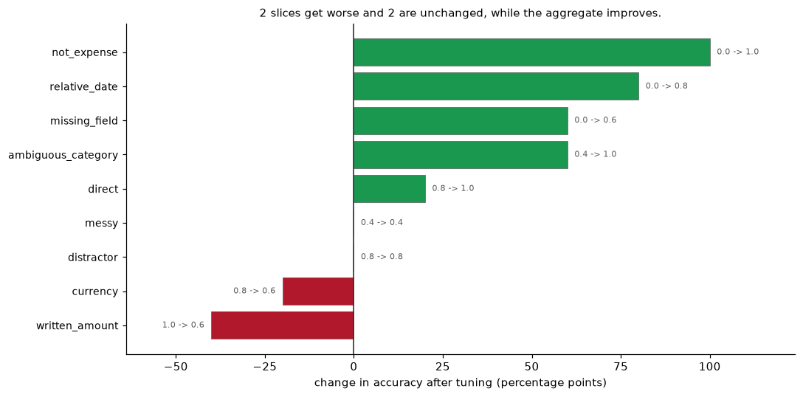
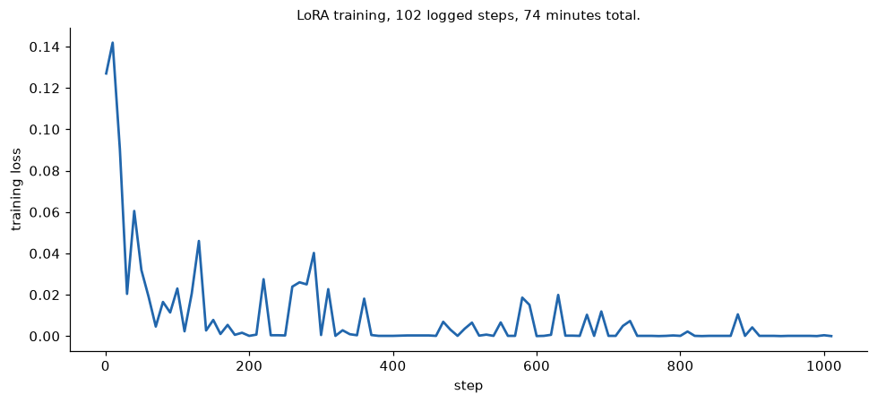
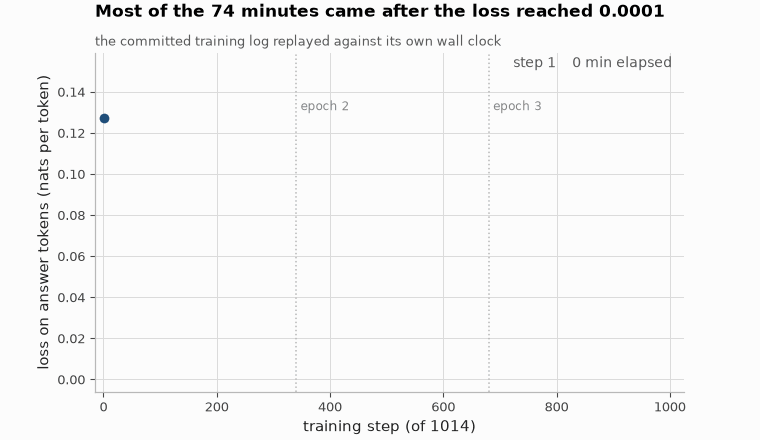

# LoRA fine-tuning, with the forgetting check that usually gets skipped

[](https://github.com/aghasalim/lora-forgetting/actions/workflows/ci.yml)
[](https://www.python.org/)
[](LICENSE)

Fine-tuning`Qwen2.5-1.5B-Instruct` with LoRA to pull structured JSON out of
informal expense messages, by a third-year Applied Computer Science (AI)
student. Trained on a MacBook Pro, no CUDA, no cloud GPU.

"I fine-tuned a model and the loss went down" is not a result. The two things
that make it one are a baseline you measured before you started, and a check
that you did not quietly break everything else. Both are here, and both numbers
lead.

---


---

## Abstract

LoRA fine-tuning is usually reported as a gain on the target task. This work
reports the gain and the cost together, fine-tuning a small language model for
structured expense extraction and then measuring whether general capability
survived.

The task gain is substantial: exact-match on all fields simultaneously rises from
46.7% to 75.6% on the held-out benchmark. The forgetting check finds no
measurable cost at this adapter size, ARC log-likelihood moves by 0.7 points,
ARC generative accuracy and open-ended answering are unchanged to the digit.

The more useful result is in the per-slice breakdown. The aggregate improvement
hides two slices that get *worse*:`written_amount` falls from 1.00 to 0.60 and
`currency` from 0.80 to 0.60, while two more are unchanged. The adapter is
redistributing accuracy across question kinds, not lifting all of them, which a
single headline number cannot show.

A separate finding concerns the forgetting check itself. Scoring ARC by
log-likelihood ranking and by free generation disagrees by 16.7 points on
identical items and the identical model, so which protocol a forgetting claim
used is part of that claim.

**Contributions.** (i) Task gain and capability retention measured on the same
adapter. (ii) A per-slice breakdown showing redistribution the aggregate hides.
(iii) Evidence that ARC scoring protocol shifts the number by more than the
fine-tuning does.

---

## 1. Both numbers, up front

**Target task**, 45 hand-written cases whose vendors never appear in training:

| | base | fine-tuned | delta |
|---|---|---|---|
| valid JSON | 93.3% | **100%** | +6.7 |
| every field correct | 46.7% | **75.6%** | **+28.9** |
| date | 66.7% | 93.3% | +26.7 |
| category | 71.1% | 91.1% | +20.0 |

**General capability**, same model, checked two different ways:

| | base | fine-tuned | delta |
|---|---|---|---|
| ARC-Easy, log-likelihood (knowledge) | 72.0% | 71.3% | **−0.7** |
| ARC-Easy, generated answer (instruction following) | 88.7% | **88.7%** | **0.0** |
| answer parseable at all | 100% | 100% | 0.0 |
| open-ended factual probes | 100% | 100% | 0.0 |

**No catastrophic forgetting**: and I want to be careful about how that reads,
because it is a real result rather than a relieved shrug. This adapter is 0.28%
of the model's parameters, trained to complete convergence (final loss 0.0000)
on a narrow task whose every answer is a JSON object. That is roughly the recipe
you would design if you *wanted* to over-specialise a model. It still answers
"what is the capital of France" in prose, and it still scores identically on 150
multiple-choice science questions.

The one movement, −0.7 points on log-likelihood, is one question out of 150. I
am not going to call that degradation.

---





## 2. Why the forgetting check is two measurements
"Forgetting" hides two failures that need different fixes, and one number cannot tell them apart: - **Knowledge** is scored by log-likelihood over the answer options, no generation at all.



Full detail in [notes/METHODS.md](notes/METHODS.md#2-why-the-forgetting-check-is-two-measurements).
## 3. What the aggregate number hides
Two slices get worse and two are unchanged while the aggregate improves.



Full detail in [notes/METHODS.md](notes/METHODS.md#3-what-the-aggregate-number-hides).
## 4. The generalisation gap I built the experiment to see
| set | base | fine-tuned | |---|---|---| | held-out synthetic (same generator as training) | 28.0% | **95.3%** | | hand-written benchmark (disjoint vendors, messier) | 46.7% | **75.6%** | Had I generated the benchmark from the same script as the training data, this project would report **95.3%** and be measuring template memorisation.

Full detail in [notes/METHODS.md](notes/METHODS.md#4-the-generalisation-gap-i-built-the-experiment-to-see).
## 5. Running it

```bash
make setup && make data && make baseline
```

```bash
make train && make eval && make forgetting && make report
```

That reproduces every number above.`make baseline` before`make train` is the
order on purpose: a baseline measured after you already have a fine-tuned model
is a baseline you can talk yourself out of.

```bash
make app
```

---

## 6. Notes on training this on a laptop
`make feasibility` measures step time and memory before committing to a run, and it changed the project twice.





*Same committed training log as the figure above, replayed in time: the loss curve and the elapsed minutes are what move, the axes and the logged numbers stay fixed.*

Full detail in [notes/METHODS.md](notes/METHODS.md#6-notes-on-training-this-on-a-laptop).
## 7. Limitations

- **No rank or target-module sweep.**`r=16` on attention projections was chosen
  up front and never varied. One run is 74 minutes on this hardware, so a sweep
  was out of budget. Nothing in this repo claims those values are optimal.
- **No hosted live demo.** The comparison app reads precomputed predictions
  because a 1.5B model needs ~3 GB against a 1 GB free tier. Showing all 45
  benchmark cases is more informative than a text box anyway, you can see the
  failures rather than the examples I would have picked.
- **No QLoRA comparison.**`bitsandbytes` has no MPS backend, so 4-bit
  quantisation is not available on this machine at all.

## 8. Repository layout

```
src/loraft/
  config.py       every knob, with the measurement that justified it
  task.py         prompt construction and scoring
  data.py         training generator, vendors disjoint from the benchmark
  train.py        LoRA loop; loss masked to answer tokens only
  evaluate.py     identical prompts for base and tuned
  forgetting.py   knowledge vs instruction-following, measured separately
eval/eval_set.jsonl   45 hand-written cases
tests/                20 tests, no model or network needed
RESULTS.md            generated from the measured JSON, not hand-typed
```

## 9. Licence

MIT, see [LICENSE](LICENSE).

## References

The papers and sources this implementation follows. Each one is here because
the code uses the method, the dataset or the metric it describes.

- **Hu, Shen, Wallis et al. LoRA: Low-Rank Adaptation of Large Language Models. ICLR 2022.** [arXiv:2106.09685](https://arxiv.org/abs/2106.09685) the adaptation method.
- **Kirkpatrick, Pascanu, Rabinowitz et al. Overcoming catastrophic forgetting in neural networks. PNAS 114, 2017.** [arXiv:1612.00796](https://arxiv.org/abs/1612.00796) the forgetting this repo measures.
- **McCloskey, Cohen. Catastrophic Interference in Connectionist Networks. Psychology of Learning and Motivation 24, 1989.** the original description of the effect.
- **Wolf, Debut, Sanh et al. Transformers: State-of-the-Art Natural Language Processing. EMNLP 2020.** [arXiv:1910.03771](https://arxiv.org/abs/1910.03771) the library.
