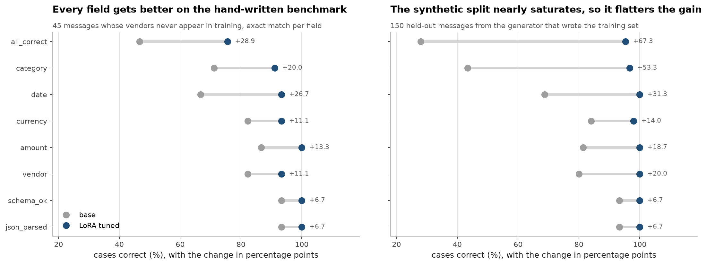
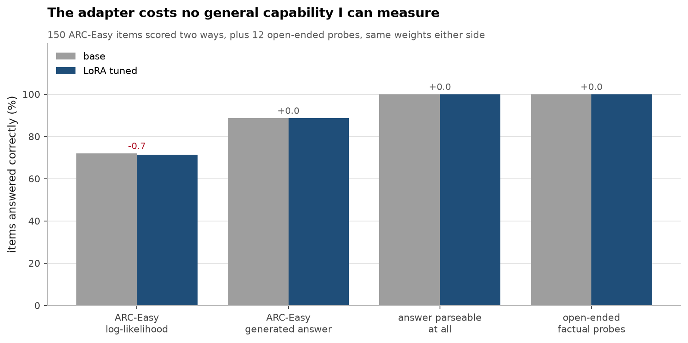
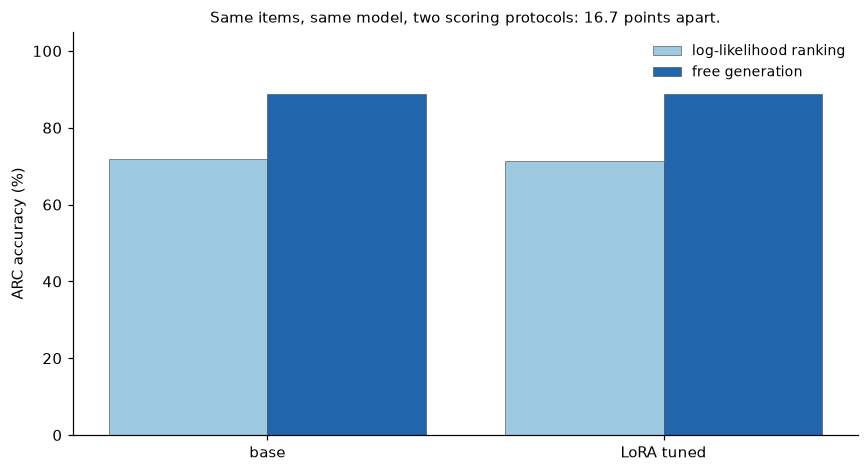
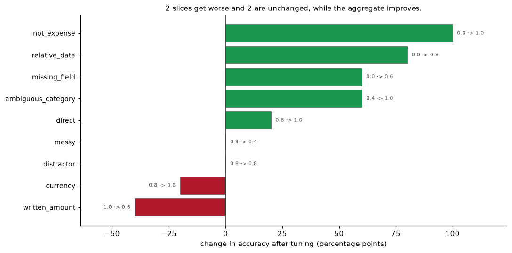
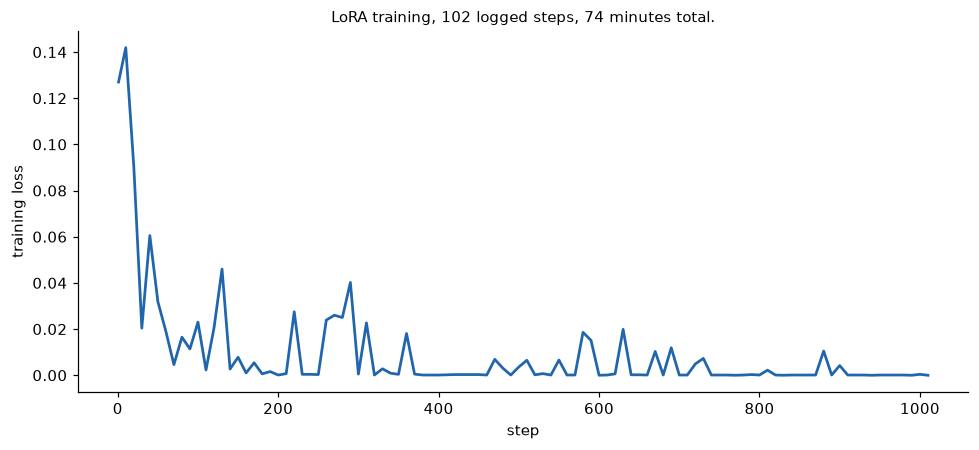
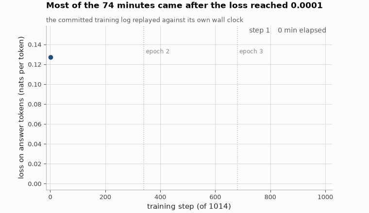

# LoRA fine-tuning, with the forgetting check that usually gets skipped

[](https://github.com/aghasalim/lora-forgetting/actions/workflows/ci.yml)
[](https://www.python.org/)
[](LICENSE)
[](https://doi.org/10.5281/zenodo.23003658)

Fine-tuning `Qwen2.5-1.5B-Instruct` with LoRA to pull structured JSON out of
informal expense messages. Trained on a MacBook Pro, no CUDA, no cloud GPU.

"I fine-tuned a model and the loss went down" is not a result. The two things
that make it one are a baseline you measured before you started, and a check
that you did not quietly break everything else. Both are here, and both numbers
lead.

---

## Abstract

LoRA fine-tuning is usually reported as a gain on the target task. This work
reports the gain and the cost together, fine-tuning a small language model for
structured expense extraction and then measuring whether general capability
survived.

The task gain is substantial: exact-match on all fields simultaneously rises from
46.7% to 75.6% on the held-out benchmark. The forgetting check finds no
measurable cost at this adapter size, ARC log-likelihood moves by 0.7 points,
ARC generative accuracy and open-ended answering are unchanged to the digit.

The more useful result is in the per-slice breakdown. The aggregate improvement
hides two slices that get *worse*: `written_amount` falls from 1.00 to 0.60 and
`currency` from 0.80 to 0.60, while two more are unchanged. Rerunning with more
seeds showed only one of those is real. `written_amount` is worse in 11 of 15
runs, `currency` in 5 of 15, and the headline itself moves between 66.7% and
82.2% with the training seed.

A separate finding concerns the forgetting check itself. Scoring ARC by
log-likelihood ranking and by free generation disagrees by 16.7 points on
identical items and the identical model, so which protocol a forgetting claim
used is part of that claim.

Contributions. (i) Task gain and capability retention measured on the same
adapter. (ii) A per-slice breakdown showing redistribution the aggregate hides.
(iii) Evidence that ARC scoring protocol shifts the number by more than the
fine-tuning does.

---

## 1. Both numbers, up front

**Target task**, 45 hand-written cases whose vendors never appear in training:

| | base | fine-tuned | delta |
|---|---|---|---|
| valid JSON | 93.3% | **100%** | +6.7 |
| every field correct | 46.7% | **75.6%** | **+28.9** |
| date | 66.7% | 93.3% | +26.7 |
| category | 71.1% | 91.1% | +20.0 |

**General capability**, same model, checked two different ways:

| | base | fine-tuned | delta |
|---|---|---|---|
| ARC-Easy, log-likelihood (knowledge) | 72.0% | 71.3% | **−0.7** |
| ARC-Easy, generated answer (instruction following) | 88.7% | **88.7%** | **0.0** |
| answer parseable at all | 100% | 100% | 0.0 |
| open-ended factual probes | 100% | 100% | 0.0 |

**No catastrophic forgetting**: and I want to be careful about how that reads,
because it is a real result. This adapter is 0.28%
of the model's parameters, trained to complete convergence (final loss 0.0000)
on a narrow task whose every answer is a JSON object. That is roughly the recipe
you would design if you *wanted* to over-specialise a model. It still answers
"what is the capital of France" in prose, and it still scores identically on 150
multiple-choice science questions.

The one movement, −0.7 points on log-likelihood, is one question out of 150. I
am not going to call that degradation.

---





## 2. Why the forgetting check is two measurements
"Forgetting" hides two failures that need different fixes, and one number cannot
tell them apart. Knowledge is scored by log-likelihood over the answer options,
with no generation at all. Instruction following asks the same questions in chat
and parses whatever comes back, and on the same 150 ARC items and the same base
model the two protocols disagree by 16.7 points, 72.0% ranked against 88.7%
generated. Both held after tuning, 72.0% to 71.3% and 88.7% to 88.7%, so this
model lost neither the facts nor the habit of answering in prose.



The two protocols, and the 16.7 point gap between them on the same items, are worked through in [the notes](notes/METHODS.md#1-why-the-forgetting-check-is-two-measurements).
## 3. What the aggregate number hides
Two slices get worse while the aggregate improves: written-out amounts drop from
100% to 60%, currency from 80% to 60%. I read all four broken cases and three are
the same failure, category falling back to "other" for a vendor that never
appeared in the training data. Across the whole benchmark category still went
32/45 to 41/45, so the fine-tune fixed 12 cases and broke 3.



All four broken cases are read individually in [the notes](notes/METHODS.md#2-what-the-aggregate-number-hides).

### Is it the seed?

Each slice has 5 cases, so one case is 20 points and a single run cannot tell a
regression from luck. I reran training on a rented RTX 3090 with two more seeds
at `r=16`, and with `r=8` and `r=32` at the original seed, alpha kept at twice
the rank. Same data, same prompts, same 45 cases. The raw predictions and logs
are in [`reports/sweep/`](reports/sweep/).

| run | every field correct | `written_amount` | `currency` |
| --- | ---: | ---: | ---: |
| base | 48.9% | 1.0 | 0.8 |
| r=16, seed 42 | 75.6% | 0.6 | 0.6 |
| r=16, seed 1 | 66.7% | 0.4 | 0.6 |
| r=16, seed 2 | 82.2% | 0.8 | 0.8 |
| r=8, seed 42 | 77.8% | 0.8 | 0.6 |
| r=32, seed 42 | 75.6% | 0.8 | 0.8 |

Seed 42 on the GPU reproduced the published run exactly, 75.6% with the same
per-slice numbers. The base model scores 48.9% there against 46.7% on the Mac,
one case out of 45 that flips on different hardware, so the GPU rows are
compared with the GPU base.

The first batch changes my reading of section 3 in two ways. The headline has
a wide seed spread: at `r=16` the three seeds give 66.7%, 75.6% and 82.2%, mean
74.8% and sd 7.8 points, and the published 75.6% happened to be the middle one.
The gain over base holds on every seed, the worst being 17.8 points, but "+28.9"
is one draw from a range. And `r=8` and `r=32` land at 77.8% and 75.6%, inside
that spread, so one seed each cannot rank them.

### A second batch, on a different GPU

The second batch ran on an RTX A5000, since the 3090 was gone by then
([`reports/sweep_a5000/`](reports/sweep_a5000/)). It asks three more questions:
do more seeds change the picture, are three epochs needed, and does putting
LoRA on the MLP projections as well help. Every row is `r=16`.

| setting | seeds | every field correct, per seed | mean |
| --- | --- | --- | ---: |
| attention, 3 epochs | 1, 2, 3, 4 | 71.1%, 80.0%, 68.9%, 80.0% | 75.0% |
| attention, 1 epoch | 42, 1, 2 | 71.1%, 80.0%, 75.6% | 75.6% |
| attention and MLP, 3 epochs | 42, 1, 2 | 77.8%, 82.2%, 77.8% | 79.3% |

The hardware moves the number too. Seed 1 gives 66.7% on the 3090 and 71.1%
on the A5000, seed 2 gives 82.2% and 80.0%. Same code, same seed, same data, and
one or two of the 45 cases flip between GPUs. So a single run on this benchmark
is not reproducible to better than about 4 points even with the seed fixed.

One epoch is enough. It scores the same as three, 75.6% against 75.0%, in 50 s of training against 152 s. Section 6 said three epochs was about three
times more than the task needed. That was a guess from the loss curve and this
confirms it.

The MLP projections are the only change that looks like a gain. 79.3% mean,
and no seed below 77.8%. It is still inside the spread of the attention runs, so
three seeds do not settle it, but it is the setting I would try first with more
compute.

`written_amount` is mostly a real regression, `currency` is noise. Across
all 15 tuned runs written-out amounts are worse than base in 11 and currency in
5. With the original attention-only setup it is worse in 6 of 7. The MLP runs
keep it at base in 2 of 3, which fits the idea that the attention-only adapter
is too narrow for that slice, but 3 runs is not evidence of that.

Forgetting holds on more seeds. I reran the ARC check for seeds 1 and 2 on
the A5000. Log-likelihood came out at 71.3% and 72.0% against 71.3% for the base
model on the same GPU, generated answers at 88.0% and 88.7% against 88.7%. That
is the same no-forgetting result as section 1, now on three seeds.

## 4. The generalisation gap I built the experiment to see
| set | base | fine-tuned |
|---|---|---|
| held-out synthetic (same generator as training) | 28.0% | **95.3%** |
| hand-written benchmark (disjoint vendors, messier) | 46.7% | **75.6%** |

Had I generated the benchmark from the same script as the training data, this
project would report **95.3%** and be measuring template memorisation. The gap
between those two rows is 19.8 points, and that is the share of the gain that
does not survive messages the generator never wrote. The base model is the odd
one out here, scoring worse on the synthetic set (28.0%) than on the hand-written
one (46.7%), because the benchmark uses famous vendors it already knew from
pretraining while the synthetic set mixes obscure ones with ten currencies.

How the benchmark was kept disjoint from the training generator is in [the notes](notes/METHODS.md#3-the-generalisation-gap-i-built-the-experiment-to-see).
## 5. Running it

```bash
make setup && make data && make baseline
```

```bash
make train && make eval && make forgetting && make report
```

Those three commands regenerate the whole results table. `make baseline` before
`make train` is the order on purpose: a baseline measured after you already have
a fine-tuned model is a baseline you can talk yourself out of. Each figure is
also re-derived from the raw prediction and log files by the independent
checkers in `verify/`; a divergence there fails the build.

```bash
make app
```

---

## 6. Notes on training this on a laptop
`make feasibility` measures step time and memory before committing to a run, and
it changed the project twice. First it ruled out float32: at fp32 the run needed
19.5 GB and 69 s/step, in bfloat16 it needed 14.2 GB and 4.2 s/step. Then the
prediction itself turned out to be wrong, because it timed fixed-length dummy
batches, and the real run on variable-length ones took 73.9 minutes. Loss was
already down to 0.003 by step 140 of 1014 and first touched 0.0001 at step 200,
so three epochs was roughly three times more than this task needed.





*The whole run, 73.9 minutes of it, against the wall clock. Watch the pace more than the shape: most of the drop is over inside the first quarter, which is why the feasibility check mattered more than the loss curve did.*

The feasibility numbers, the Docker stall and where the 73.9 minutes went: [the notes](notes/METHODS.md#4-notes-on-training-this-on-a-laptop).
The run itself, read back from the log with every setting traced to its
line, is in [notes/TRAINING.md](notes/TRAINING.md).
## 7. Limitations

A thin sweep. `r=8` and `r=32` were run once each and the MLP targets three
times (section 3). None of them separates cleanly from the seed spread of
`r=16`. Nothing in this repo claims these values are optimal.

The forgetting check has three seeds. Section 1 is the laptop run
and seeds 1 and 2 were rechecked on a GPU (section 3). The other runs were
scored on the target task only.

No hosted live demo. The comparison app reads precomputed predictions
because a 1.5B model needs ~3 GB against a 1 GB free tier. Showing all 45
benchmark cases is more informative than a text box anyway, you see the failures, not just the examples I would have picked.

No QLoRA comparison. `bitsandbytes` has no MPS backend, so 4-bit
quantisation is not available on this machine at all.

## 8. Repository layout

```
src/loraft/
  config.py       every knob, with the measurement that justified it
  task.py         prompt construction and scoring
  data.py         training generator, vendors disjoint from the benchmark
  train.py        LoRA loop; loss masked to answer tokens only
  evaluate.py     identical prompts for base and tuned
  forgetting.py   knowledge vs instruction-following, measured separately
eval/eval_set.jsonl   45 hand-written cases
tests/                20 tests, no model or network needed
verify/               every RESULTS.md row, re-derived from the raw JSON
RESULTS.md            generated from the measured JSON, not hand-typed
```

## 9. Licence

MIT, see [LICENSE](LICENSE).

## References

Where the method, the effect it risks and the tooling all come from.

- **Hu, Shen, Wallis et al. LoRA: Low-Rank Adaptation of Large Language Models. ICLR 2022.** [arXiv:2106.09685](https://arxiv.org/abs/2106.09685) the adaptation method.
- **Kirkpatrick, Pascanu, Rabinowitz et al. Overcoming catastrophic forgetting in neural networks. PNAS 114, 2017.** [arXiv:1612.00796](https://arxiv.org/abs/1612.00796) the forgetting this repo measures.
- **McCloskey, Cohen. Catastrophic Interference in Connectionist Networks. Psychology of Learning and Motivation 24, 1989.** the original description of the effect.
- **Wolf, Debut, Sanh et al. Transformers: State-of-the-Art Natural Language Processing. EMNLP 2020.** [arXiv:1910.03771](https://arxiv.org/abs/1910.03771) the library.
